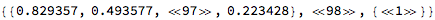
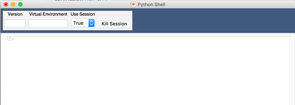
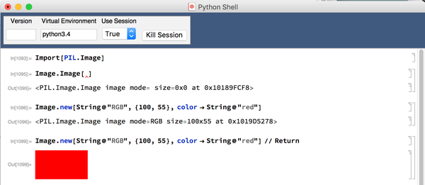
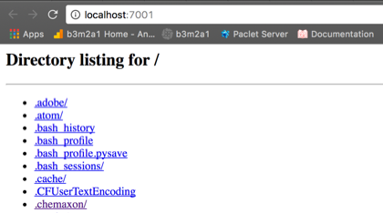

<a id="pytools" style="width:0;height:0;margin:0;padding:0;">&zwnj;</a>

# PyTools

This is an application for working with python processes. It provides a basic, extensible framework for generating python sessions, running python code, and a few utilities based on these.

The application supports a few core pieces of functionality:

---

<a id="python-core" style="width:0;height:0;margin:0;padding:0;">&zwnj;</a>

## Python Core

### Packages

* [PyTools](Packages/PyTools.m)

* [Sessions](Packages/Sessions/Sessions.m)

* [SymbolicPython](Packages/Symbolic/SymbolicPython.m)

* [Script](Packages/Sessions/Script.m)

### Description

This is the heart of the framework. A  [```ProcessObject```](https://reference.wolfram.com/language/ref/ProcessObject.html)  corresponding to a python interpreter or the  [```$SystemShell```](https://reference.wolfram.com/language/ref/%24SystemShell.html)  can be generated and code can be passed to it to run with a convenient polling mechanism to make sure it hasn’t crashed.

The core function for using the framework is  ```PyRun```  which hooks up the sessions, code generation, and scripts interfaces. The  [Sessions](Packages/Sessions/Sessions.m)  package provides access to the underlying session config, the  [SymbolicPython](Packages/Symbolic/SymbolicPython.m)  package provides an interface for generating symbolic representations of python code, and the  [Script](Packages/Sessions/Script.m)  package provides an interface for using python-side scripts to facilitate communication between the sides.

### Examples

Here’s a very basic example of running some code:

	PyRun[Print["I am a llama"]]

	(*Out:*)
	
	"I am a llama"

We’ll go one step further and import something on the python side to be used in a session and using a specific python version:

	PyRun[
	  Import["numpy"];
	  myarr = numpy.array[{1, 2, 3}];
	  myarr,
	  "Version" -> "3.4", 
	  "UseSession" -> True
	  ]

	(*Out:*)
	
	"array([1, 2, 3])"

We’ll note that we can now use this  ```myarr```  object elsewhere in that session. Here we’ll take 10 of its properties at random

	PyRun[
	   Return[dir@myarr],
	   "Version" -> "3.4", 
	   "UseSession" -> True
	   ] // RandomSample[#, 10] &

	(*Out:*)
	
	{"__or__", "choose", "__repr__", "itemset", "__getitem__", \
	"__isub__", "transpose", "__iter__", "__float__", "__ixor__"}

The  ```Return```  keyword at the end of the code block tells the package to try to import that result as a Mathematica expression. Note that using sessions is much faster than running a bunch of stand-alone code, once the session has been initialized:

	(*With session*)
	PyRun[
	    Import["numpy"],
	    "Version" -> "3.4", 
	    "UseSession" -> True
	    ] // AbsoluteTiming // First

	(*Out:*)
	
	0.016188

	(*Without session*)
	PyRun[
	    Import["numpy"],
	    "Version" -> "3.4"
	    ] // AbsoluteTiming // First

	(*Out:*)
	
	0.389223

We can view properties of this session using the framework in the  [Sessions](Packages/Sessions/Sessions.m)  package:

	Needs["PyTools`Sessions`"];
	PySessions[]

	(*Out:*)
	
	Dataset[ <> ]

The framework provides much more control over sessions, but we won’t delve into that here.

The code  ```PyRun```  is actually sending to the session is generally generated via the   [SymbolicPython](Packages/Symbolic/SymbolicPython.m)  package. (you can see the code it’s building via the  ```"EchoCode"```  parameter). Let’s take a look at what that does:

	Needs["PyTools`Symbolic`"];
	ToSymbolicPython[
	  Module[{x},
	    Import["numpy"];
	    Print[x]
	    ]
	  ]

	(*Out:*)
	
	PyLambda[PySymbol["x"]][{PyImport["numpy"], PyPrint[PySymbol["x"]]}]

We can see it builds up a symbolic representation of the code we sent it. Many things are supported (but obviously even more are not). This symbolic representation can then be marshalled down to a string via  ```ToPython``` .

	ToSymbolicPython[
	   Module[{x},
	     Import["numpy"];
	     Print[x]
	     ]
	   ] // ToPython

	(*Out:*)
	
	"( lambda x: (\n\timport numpy,\n\tprint(x),\n\t)[-1]\n )"

To effectively use this requires good knowledge of python and Mathematica, as the syntax is generally a mixture of python structures, Mathematica structures, and some judgement calls. For instance,  ```Module```  is being treated as an anonymous  ```lambda```  function which scopes its parameter. Other things have more direct translations:

	ToSymbolicPython[
	   Map[Print, Range[10]]
	   ] // ToPython

	(*Out:*)
	
	"list(map(print, range(10)))"

Other things that perhaps look like more Mathematica code are translated to their python equivalents:

	ToSymbolicPython[
	   Insert[$Path, my$dir, 0]
	   ] // ToPython

	(*Out:*)
	
	"import sys\nsys.path.insert(0, my_dir)\n"

The rules underlying this will be documented if there is sufficient demand for it.

The script interface makes it easier to write python-side scripts for in python code. It simply provides a loader interface for those. It also provides an export system, which is used by  ```PyRun```  when the final value is wrapped in  ```Return``` . Currently export always route to JSON for serialization, but for other data-types (e.g. pandas data frames) other exporters will be written. An import framework will be added in the future.

A quick example of how this works:

	PyRun[
	  Import["numpy"];
	  arr = numpy.array[Range[10]];
	  Return[list[arr + arr]],
	  "Version" -> "3.4",
	  "UseSession" -> True
	  ]

	(*Out:*)
	
	{0, 2, 4, 6, 8, 10, 12, 14, 16, 18}

A python  ```list```  can (generally) be serialized to JSON, so it can be imported back into Mathematica as a list. A future export rule might add support for taking a  ```numpy.array```  and sending it through as a list. 

Big data automatically routes through a temporary file. For example:

	PyRun[
	   Import["numpy"];
	   arr = numpy.random.rand[100, 100];
	   Return@Map[list, arr],
	   "Version" -> "3.4",
	   "UseSession" -> True
	   ] // Short

	(*Out:*)
	
 

---

<a id="python-shell" style="width:0;height:0;margin:0;padding:0;">&zwnj;</a>

## Python Shell

### Stylesheets

* [PythonShell](FrontEnd/StyleSheets/PyTools/PythonShell.nb)

### Description

The  [PythonShell](FrontEnd/StyleSheets/PyTools/PythonShell.nb)  stylesheet provides a shell-like interface to the python interface. A new one can be made like so:

	PyNewShell[]

	(*Out:*)
	
	NotebookObject[FrontEndObject[LinkObject["nh9n2_shm", 3, 1]], 1239]



This interface uses  ```PyRun```  naturally, allowing us to easily do things like this:



(Note that  ```Return```  in this context simply tells  ```PyRun```  to apply export scripts rather than passing the string representation through)

---

<a id="python-utilities" style="width:0;height:0;margin:0;padding:0;">&zwnj;</a>

## Python Utilities

### Packages

* [PyServer](Packages/Utilities/PyServer.m)

### Description

The core use of this package will be to expand the basic framework by adding a collection of utilities. For now, there is only one utility, which is an interface to the  ```SimpleHTTPServer```  module. More utilities will be added as time permits.

### Examples

The current sole utility is an HTTP server:

	Needs["PyTools`Utilities`"];
	PyServerOpen[Directory[]]

 